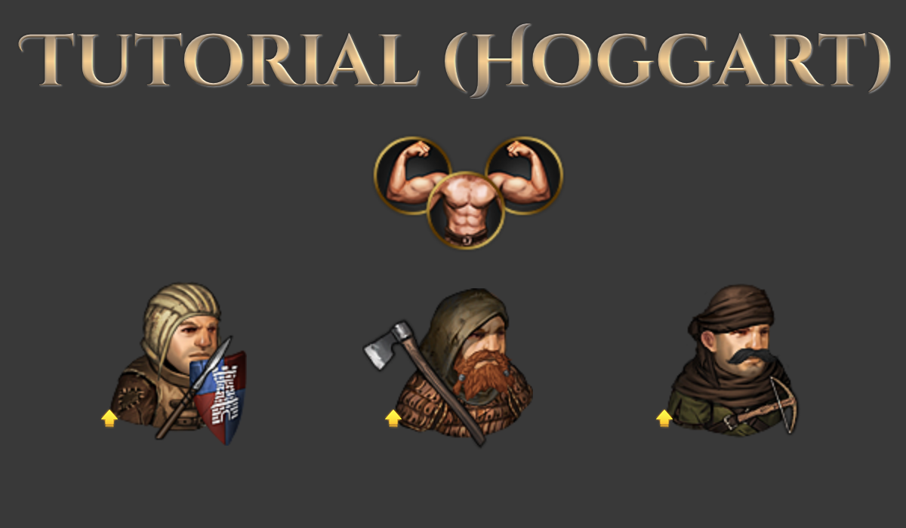
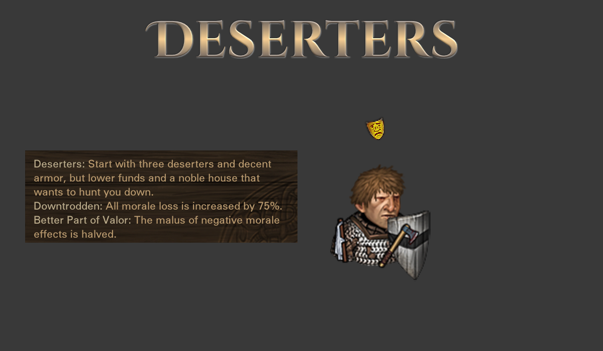
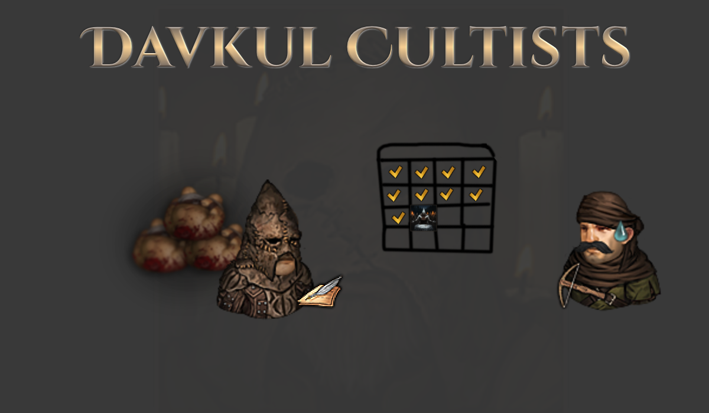

# Sato's Rebalanced Vanilla Origins

A mod for the game Battle Brothers ([Steam](https://store.steampowered.com/app/365360/Battle_Brothers/), [GOG](https://www.gog.com/game/battle_brothers), [Developer Site](http://battlebrothersgame.com/buy-battle-brothers/)).

## Table of contents

-   [Features](#features)
-   [Requirements](#requirements)
-   [Installation](#installation)
-   [Uninstallation](#uninstallation)
-   [Compatibility](#compatibility)
-   [Building](#building)

## Features

This mod rebalances a few of the official origins in the game that I felt needed some tweaking.

### **Tutorial (Hoggart) Origin**

Following some discussion on various game forums, I came to the conclusion that the tutorial origin is actually one of the weaker ones. The starting bros and gear, while fine, are substantially weaker than, say, the Northern Raiders' or even Beast Slayers. It makes more sense to me for the origin's start to be a little stronger to give new players a sturdier crutch getting their campaign off the ground.

The specific changes are:
- All starting bros begin the campaign at level 3
- Shield companion bro now starts a heater shield
- Axe companion bro now starts with better armor on average (up to Leather Lamellar)
- Crossbro now starts with basic headgear (either a hood or headwrap)

The "quickstart" origin that doesn't have the tutorial contract is unchanged, to preserve that experience for those who want it.

### **Deserters Origin**

In the origin's description and opening event, the Deserters are framed not as cowards, but as selfish. They don't desert out of fear of battle, but rather out of protest for the miserable conditions they lived in.

Mechanically, their unique origin ability is useful _only_ for avoiding battles from the get go, and their starting bros - being deserters - have a coward's Resolve. This doesn't really match the description above, but much more importantly is uninteresting to play. Retreating on turn one doesn't open any new _tactical_ options to the player, and players are already incentivized to avoid taking fights they can't win.

With this mod, instead of their "act first on the first round ability" Deserters now have two new mechanics:
- All mood loss is increased by 75%
- The malus of negative morale effects is halved

The idea here is that your bros will be quick to desert your company for the same reasons they deserted the noble houses: you didn't feed them, pay them, or keep them alive. On the other hand, your bros are better able to fight (or flee) in spite of their mood. They know better than the average man how to get out when the going gets rough, and they're more likely to actually survive a retreat.

### **Davkul Cultists Origin**

The major complaint most people have about the Davkul Cultists is the unreliability of the origin's unique sacrifice event off which all their unique mechanics key. Thematically, the other major shortcoming is that players are encouraged to keep literal sacrificial pawns in their reserve to offer up in these events, rather than making any actually meaningful sacrifice.

With this mod, the sacrifice event has been changed in a few key ways:
- It's guaranteed to trigger every 19-23 days
- Your two options for sacrifices will be one of your least experienced and one of your most experienced bros (prophets will never be chosen)
- Sacrificing the more experienced bro will guarantee a "rank" upgrade for all your cultists, while the less experienced bro grant rewards as in vanilla
- If you sacrifice your highest "rank" (e.g. fanatic, disciple, chosen) bro, your next highest rank bro will be bumped up to match so you don't lose progress towards getting a prophet

With these changes the origin is less dependent on chance for its mechanics to kick in, and the player is given an actual reason to consider losing an otherwise valuable bro.

## Requirements

1) [Modding Script Hooks](https://www.nexusmods.com/battlebrothers/mods/42) (v20 or later)
2) The Cultist and Deserter origins require [Warriors of the North](http://battlebrothersgame.com/warriors-of-the-north-release/)

## Installation

1) Download the mod from the [releases page](https://github.com/jcsato/sato_enemy_balance_mod/releases/latest)
2) Without extracting, put the `sato_rebalanced_vanilla_origins_*.zip` file in your game's data directory
    1) For Steam installations, this is typically: `C:\Program Files (x86)\Steam\steamapps\common\Battle Brothers\data`
    2) For GOG installations, this is typically: `C:\Program Files (x86)\GOG Galaxy\Games\Battle Brothers\data`

## Uninstallation

1) Remove the relevant `sato_rebalanced_vanilla_origins_*.zip` file from your game's data directory

## Compatibility

This should be fully save game compatible, i.e. you can make a save with it active and remove it without corrupting that save. Scaling on Barbarian camps may take some time to readjust.

### Building

To build, run the appropriate `build.bat` script. This will automatically compile and zip up the mod and put it in the `dist/` directory, as well as print out compile errors if there are any. The zip behavior requires Powershell / .NET to work - no reason you couldn't sub in 7-zip or another compression utility if you know how, though.

Note that the build script references the modkit directory, so you'll need to edit it to point to that before you can use it. In general, the modkit doesn't play super nicely with spaces in path names, and I'm anything but a batch expert - if you run into issues, try to run things from a directory that doesn't include spaces in its path.

After building, you can easily install the mod with the appropriate `install.bat` script. This will take any existing versions of the mod already in your data directory, append a timestamp to the filename, and move them to an `old_versions/` directory in the mod folder; then it will take the built `.zip` in `dist/` and move it to the data directory.

Note that the install script references your data directory, so you'll need to edit it to point to that before you can use it.
